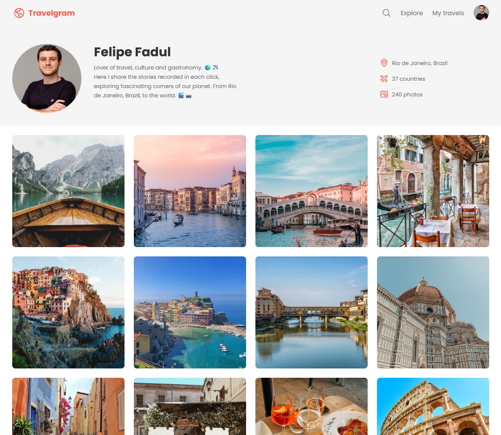

# Travelgram

- This project is part of the [Full-Stack MBA course](../../) at [Rocketseat](https://www.rocketseat.com.br/). It is a simple web page that displays a travel photo gallery, showing the fundamentals of web development and CSS Flexbox.

## ✨ Features

- Display a travel photo gallery on a fictional social media called Travelgram.

## 💻 Technologies Used

- HTML
- CSS

## 📝 How to Run the Project

1. Clone the repository to your local machine.
2. Open the `index.html` file in your web browser.

## ✏️ Design

- [Figma](https://www.figma.com/community/file/1360315496868719817).
- Designed by [Rocketseat](https://www.rocketseat.com.br/).

## 👨‍💻 Author

### Felipe Fadul

Full Stack Software Engineer with a front-end focus, passionate about delivering tech solutions with the best user experience.

Feel free to follow me on [GitHub](https://github.com/felipefadul) and get in touch with me on [LinkedIn](https://www.linkedin.com/in/felipefadul/).
