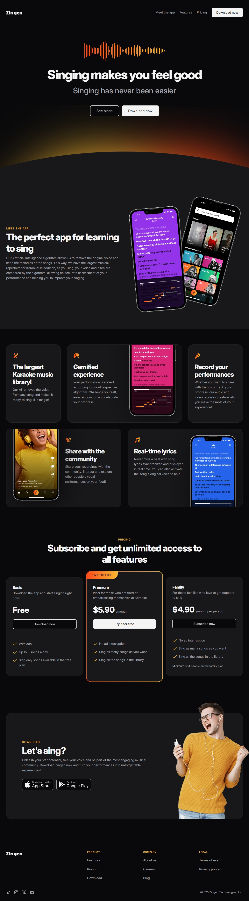
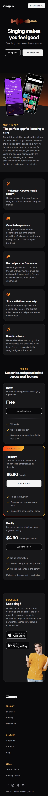

# Karoake App Landing Page

- This project is part of the [Full-Stack MBA course](../../) at [Rocketseat](https://www.rocketseat.com.br/). It is a fully responsive web page that displays a karaoke app landing page. You can access this project [here](https://felipefadul.github.io/fullstack-mba-rocketseat/01-web-development-fundamentals/005-karaoke-app-landing-page/).

  
  

## ✨ Features

- Display a fully responsive landing page for a karaoke app called Ginzen.
- It was built using the mobile-first approach, so it looks great on mobile devices and desktops.

## 💻 Technologies Used

- HTML
- CSS

## 📝 How to Run the Project

1. Clone the repository to your local machine.
2. Open the `index.html` file in your web browser.

## ✏️ Design

- [Figma](https://www.figma.com/community/file/1371886246180677672).
- Designed by [Rocketseat](https://www.rocketseat.com.br/).

## 👨‍💻 Author

### Felipe Fadul

Full Stack Software Engineer with a front-end focus, passionate about delivering tech solutions with the best user experience.

Feel free to follow me on [GitHub](https://github.com/felipefadul) and get in touch with me on [LinkedIn](https://www.linkedin.com/in/felipefadul/).
