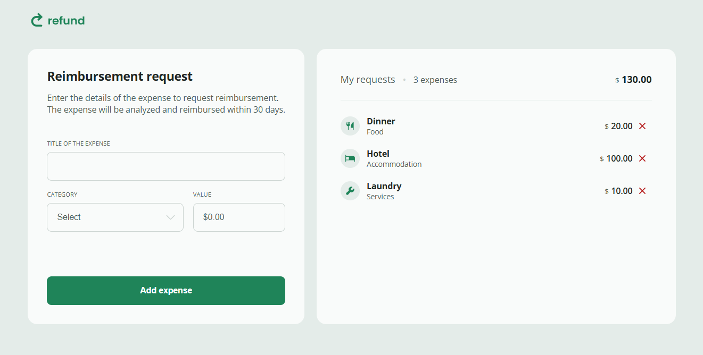
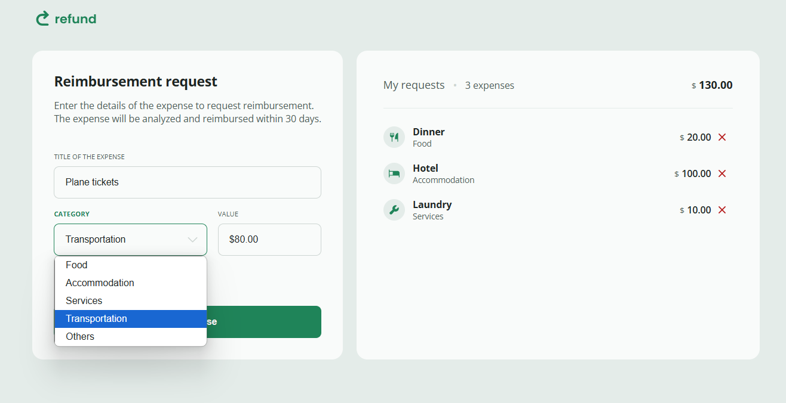

# Refund Request

- This project is part of the [Full-Stack MBA course](../../) at [Rocketseat](https://www.rocketseat.com.br/). It is a fully responsive web page that displays a refund request app, showing the fundamentals of DOM manipulation with JavaScript. You can access this project [here](https://felipefadul.github.io/fullstack-mba-rocketseat/01-web-development-fundamentals/008-refund-request/).

## ✨ Features

- Display a fully responsive reimbursement request app where users can add expenses.

## 💻 Technologies Used

- HTML
- CSS
- JavaScript

## 📝 How to Run the Project

1. Clone the repository to your local machine.
2. Open the `index.html` file in your web browser.

## ✏️ Design

- [Figma](https://www.figma.com/community/file/1360316109107378379).
- Designed by [Rocketseat](https://www.rocketseat.com.br/).

## 👨‍💻 Author

### Felipe Fadul

Full Stack Software Engineer with a front-end focus, passionate about delivering tech solutions with the best user experience.

Feel free to follow me on [GitHub](https://github.com/felipefadul) and get in touch with me on [LinkedIn](https://www.linkedin.com/in/felipefadul/).
