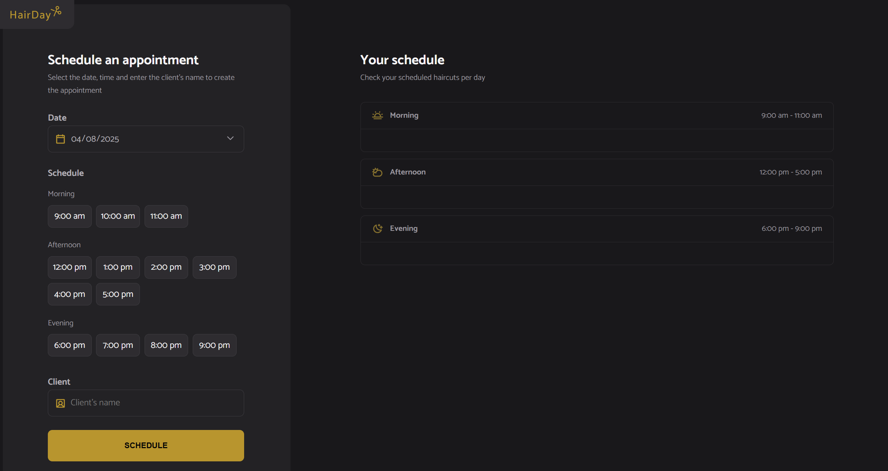
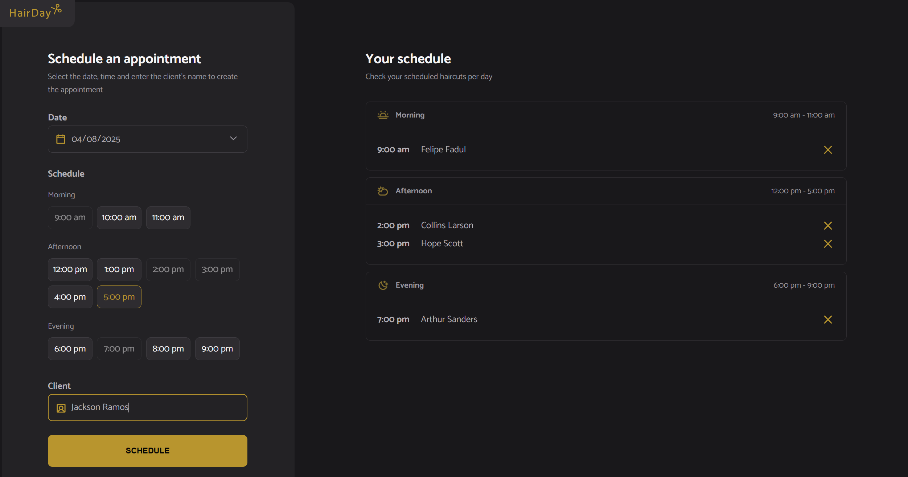

# Haircut Scheduling

- This project is part of the [Full-Stack MBA course](../../) at [Rocketseat](https://www.rocketseat.com.br/). It is a fully responsive web page that displays a haircut scheduling app. You can access this project [here](https://haircut-scheduling.vercel.app/).

## ✨ Features

- Display a fully responsive haircut scheduling app where users can select the date, time and enter the client's name to create the appointment.

## 💻 Technologies Used

- HTML
- CSS
- JavaScript
- Webpack
- JSON Server

## 📝 How to Run the Project

1. Clone the repository.
2. Go to the path `fullstack-mba-rocketseat/01-web-development-fundamentals/009-haircut-scheduling`.
3. Run `npm install`.
4. Run `npm run server`.
5. Run `npm run dev`.
6. Open `http://localhost:3000/` in your web browser.
7. If you want to check the local server data, open `http://localhost:3333/schedules` in your web browser.

## ✏️ Design

- [Figma](https://www.figma.com/community/file/1360316357733167308).
- Designed by [Rocketseat](https://www.rocketseat.com.br/).

## 👨‍💻 Author

### Felipe Fadul

Full Stack Software Engineer with a front-end focus, passionate about delivering tech solutions with the best user experience.

Feel free to follow me on [GitHub](https://github.com/felipefadul) and get in touch with me on [LinkedIn](https://www.linkedin.com/in/felipefadul/).
