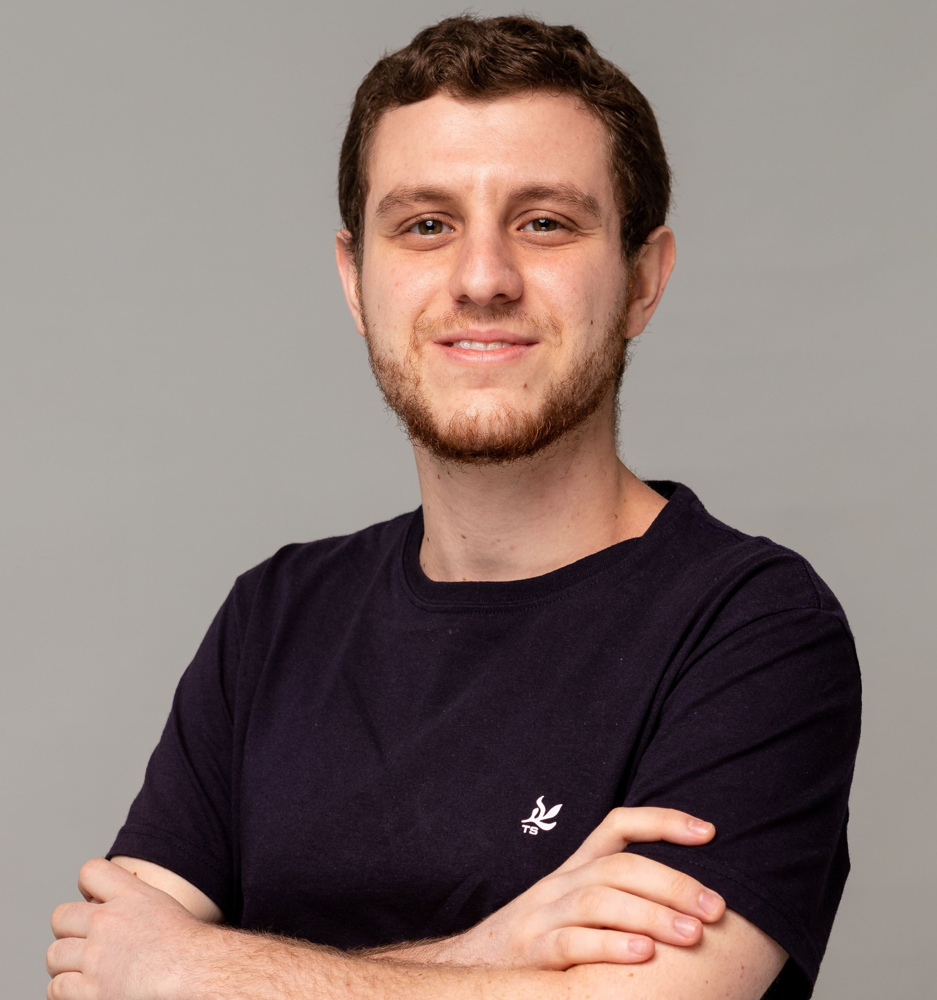

# 🚀 Rocketseat Full-Stack MBA Journey  

Welcome to my repository documenting my journey through the **Full-Stack MBA** at [Rocketseat](https://www.rocketseat.com.br/). This program focuses on a **project-based learning methodology**, which perfectly aligns with my passion for hands-on learning and continuous growth.

## 📝 About the Rocketseat Full-Stack MBA

The **Rocketseat Full-Stack MBA** is a comprehensive program designed for professionals looking to deepen their skills in modern web development, system architecture, and product building. With a focus on **hands-on learning**, the program prepares students to solve real-world challenges by integrating technology, leadership, and business strategy.

### **Program Highlights**

- **Duration:** 12 months (360 hours).
- **Number of Projects:** 5 main projects + several secondary ones.
- **Methodology:** Project-based learning with practical, real-world applications.

## 📖 Syllabus  

The curriculum is designed to cover a wide spectrum of technologies and strategies, ensuring participants are well-equipped to build scalable, impactful solutions. Each module contains several complementary activities that reinforce the concepts learned, such as projects, quizzes, masterclasses with industry experts and an end-of-module main project.

1. **Web Development Fundamentals**
   - Web Fundamentals
   - HTML, CSS and Javascript from basic to advanced
   - Javascript before the framework
   - Typescript
   - Git & Github

2. **Front-End Development**
   - React.js fundamentals
   - Creating SPAs
   - API consumption
   - HTTP and Performance
   - React Hook Form
   - React Query
   - Automated tests
   - Design System
   - Next.js

3. **Back-End Development**
   - Node.js fundamentals
   - Creating a REST API with Node.js
   - Node.js API with SOLID
   - DDD in Node.js
   - Clean Architecture
   - NestJS
   - Vitest
   - Prisma
   - Zod
   - Fastify
   - JWT

4. **Mobile Development**
   - React Native fundamentals
   - Creating Interfaces
   - Navigation strategies
   - Back-end integration
   - Push Notifications
   - Deep Linking
   - Animations and Microinteraction
   - Social Login
   - Local Storage
   - Offline-first database and Cloud Sync
   - Geolocation and Maps
   - Automated Testing
   - App Publishing
   - Continuous Integration & Continuous Delivery

5. **Soft Skills of the Full-Stack Professional**
   - From strategy to product
   - Agile methodologies
   - Assertive communication
   - Emotional intelligence
   - Tech Lead
   - Branding and positioning on social networks
   - Intrapreneurship
   - Innovation
   - Time management
   - Mental health

## 🛠️ MBA Projects Showcase

This repository will evolve as I progress through the MBA. Each project will have its own folder with a `README.md` file containing details about the project, such as the technologies used, how to run the project, features and design. Some projects will be in another repository, and I will link them here:

1. **Web Development Fundamentals**
   - [Recipe Page](01-web-development-fundamentals/001-recipe-page)
   - [Travelgram](01-web-development-fundamentals/002-travelgram)
   - [Tech News](01-web-development-fundamentals/003-tech-news)
   - [Enrollment Form](01-web-development-fundamentals/004-enrollment-form)
   - [Karaoke App Landing Page](01-web-development-fundamentals/005-karaoke-app-landing-page)

## 👨‍💻 Author

### Felipe Fadul

Full Stack Software Engineer with a front-end focus, passionate about delivering tech solutions with the best user experience.

Feel free to follow me on [GitHub](https://github.com/felipefadul) and get in touch with me on [LinkedIn](https://www.linkedin.com/in/felipefadul/).
